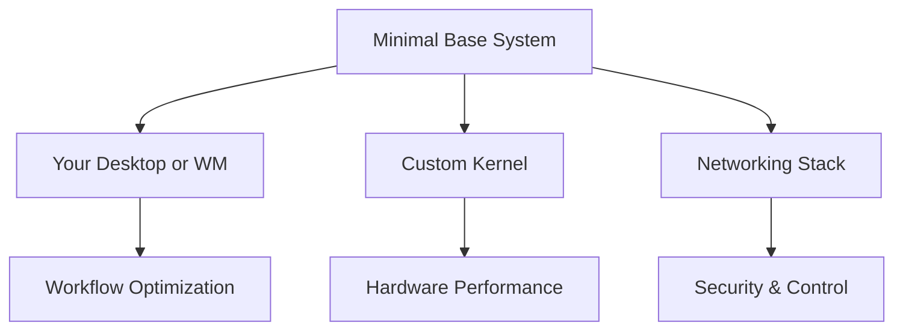

# 🏗️ Arch Linux Build Your Perfect System

[](https://archlinux.org/)

[Arch Linux](https://archlinux.org/) is a **DIY Linux distribution** designed for users who value **control**, **simplicity**, and **bleeding-edge software**. Rather than giving you a preset experience, Arch provides a clean slate to build a system tailored to your exact needs.

> “Arch is what you make it.” — *The Arch Way*

---

## 🧠 Philosophy: The Arch Way

- 🔄 **Rolling Release**: No major version upgrades. Updates are incremental and continuous.
- 🧽 **Simplicity**: Keep things minimal and clean.
- ⚡ **User Centrality**: You configure it. You break it. You fix it. You learn.
- 🧰 **Transparency**: Plain-text configs and clear documentation.
- 🌐 **Community-Driven**: A thriving ecosystem fueled by passionate contributors.

---

## 🕰️ A Brief History of Arch

| Year     | Milestone                                               | Impact                                                 |
|----------|----------------------------------------------------------|--------------------------------------------------------|
| 2002     | v0.1 *"Homer"* by Judd Vinet                             | Inspired by CRUX; simplicity and elegance focused       |
| 2006     | x86_64 support                                           | Embraced modern hardware                               |
| 2007     | Aaron Griffin becomes lead                               | Kickstarted community-driven development               |
| 2012     | Switch to `systemd`                                      | Unified and simplified system boot and service control |
| 2017     | Dropped 32-bit/i686 support                              | Full focus on 64-bit computing                         |
| 2020     | Levente Polyak takes leadership                          | Enhanced tooling and project direction                 |
| 2022     | Steam Deck ships with Arch base (SteamOS 3.0)           | Proof of stability and performance                     |

---

## 📦 Pacman + AUR = Power

Arch’s package ecosystem gives you access to **official binaries** via `pacman`, and a vibrant **community repository** (AUR):

```bash
# Install official packages
sudo pacman -S <package>

# Full system upgrade
sudo pacman -Syu

# Search AUR via yay (AUR helper)
yay -Ss <package>
````

* 🔹 `pacman`: Fast, simple, reliable
* 🔸 AUR: Thousands of user-maintained packages

---

## 🎯 Why Choose Arch?

| Feature       | Why It Matters                                                |
| ------------- | ------------------------------------------------------------- |
| Minimalism    | Install only what you need—nothing more                       |
| Control       | You make every decision from the bootloader to the desktop    |
| Learning      | Teaches core Linux principles through hands-on configuration  |
| Documentation | The [Arch Wiki](https://wiki.archlinux.org/) is legendary     |
| Community     | Helpful forums, IRC, Reddit, and a strong contributor culture |

> 💡 **Note**: Expect 30–60 minutes for a typical install. In return, you get a clean, personalized system.

---

## 👤 Who Thrives with Arch?

| User Type      | Why Arch Works                          | Starter Tools                        |
| -------------- | --------------------------------------- | ------------------------------------ |
| Linux Artisans | Absolute control                        | `i3wm`, `bspwm`, `polybar`           |
| Developers     | Latest toolchains, minimal interference | `Docker`, `VSCode`, `Kubernetes`     |
| SysAdmins      | Hardened, predictable environments      | `Ansible`, `Podman`, `WireGuard`     |
| Minimalists    | Under 300MB base install                | `tmux`, `neovim`, `dwm`, `alacritty` |
| Learners       | Understand Linux inside-out             | `htop`, `strace`, `Arch Wiki`, `man` |

---

## 🏢 Who Uses Arch in Production?

Arch is more than a playground—it's a **foundation** for serious projects:

* 🎮 **Valve Steam Deck** Arch-based SteamOS 3.0
* 🍓 **Arch Linux ARM**  Powering Raspberry Pi clusters
* 🔐 **Security Labs**  Clean forensic baselines
* 🔬 **Research Institutes**  Custom kernels for HPC and simulations



---

## 💎 The Ultimate Linux Experience

Arch is a **platform**, not a product. With it, you can:

* 🔄 Manage services precisely with `systemctl`
* 🛠️ Build or choose custom kernels (`linux-lts`, `linux-zen`, etc.)
* ⚡ Compile for your CPU:

  ```bash
  # In /etc/makepkg.conf
  CFLAGS="-march=native -O2 -pipe"
  CXXFLAGS="${CFLAGS}"
  ```

> “You don't just use Arch you *craft* it. Every config file tells your story.”

---

## 🧪 Explore Derivatives

* **Archcraft** – Aesthetic, tiling WM-focused distro
* **ArcoLinux** – Preconfigured, tutorial-rich flavor of Arch

---

## 🚀 Start Your Arch Journey


1. **Post-Install Basics**

   ```bash
   # Install X server and desktop environment
   pacman -S xorg-server xorg-xinit gnome gnome-extra  # Or plasma-meta for KDE

   # Enable display manager
   systemctl enable gdm.service  # Or sddm, lightdm
   ```

2. 📚 **Join the Community**

  * [Forums](https://bbs.archlinux.org/)
  * [IRC Channels](https://wiki.archlinux.org/title/IRC_channels)
  * [Subreddit](https://reddit.com/r/archlinux)
  * [Official Installation_guide](https://wiki.archlinux.org/title/Installation_guide)
  * [Arch Wiki](https://wiki.archlinux.org/title/Arch_Linux)

> 🧱 **In Summary**: Arch isn't just an operating system it's your **Linux blueprint**.
