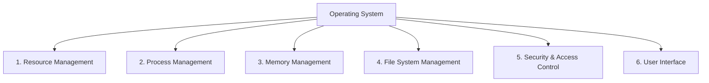

# 🌟 Core Functions of an Operating System

The **Operating System (OS)** serves as the foundational software layer that orchestrates all interactions between hardware components, application software, and users. It ensures efficient, secure, and reliable system operation.

Modern operating systems universally perform these **six core functions**:

---

## 🧭 Functional Overview

---

## 1️⃣ Resource Management

The OS optimizes hardware resource allocation to maximize efficiency and prevent conflicts.

**Key Responsibilities:**
- Distributes CPU time among processes
- Manages RAM allocation and reclamation
- Controls storage device access
- Mediates peripheral I/O operations

---

## 2️⃣ Process Management

The OS governs program execution states and lifecycle, enabling concurrent operations.

**Key Mechanisms:**
- **Multitasking:** Executes multiple processes simultaneously
- **Scheduling:** Determines process execution order
- **Isolation:** Prevents inter-process interference
- **Deadlock handling:** Detects and resolves resource conflicts

---

## 3️⃣ Memory Management

The OS controls primary memory allocation while protecting critical system areas.

**Key Techniques:**
- Dynamic memory allocation/deallocation
- **Virtual memory implementation:** Extends RAM using disk space
- Memory protection boundaries
- Address translation services

---

## 4️⃣ File System Management

The OS provides structured data storage with standardized access methods.

**Key Capabilities:**
- File/directory creation, access, and deletion
- Storage space allocation tracking
- Permission and access control enforcement
- Support for multiple file systems (NTFS, ext4, APFS)

---

## 5️⃣ Security and Access Control

The OS enforces protection mechanisms for system integrity and data confidentiality.

**Key Functions:**
- User authentication and authorization
- Permission hierarchies (read/write/execute)
- Process sandboxing and isolation
- Security auditing and threat monitoring

---

## 6️⃣ User Interface

The OS provides human interaction channels for system control.

**Interface Types:**
- **GUI (Graphical):** Visual elements (windows, icons)
- **CLI (Command-Line):** Text-based commands and automation

---

## 🧠 Functional Summary

| Core Function          | Primary Responsibility                          |
|------------------------|-------------------------------------------------|
| Resource Management    | Optimizes CPU, memory, and device utilization   |
| Process Management     | Controls program execution and concurrency      |
| Memory Management      | Allocates RAM and implements virtual memory     |
| File System Management | Organizes persistent storage and file operations|
| Security & Access      | Enforces protection policies and authentication |
| User Interface         | Enables human-computer interaction              |

---

## 🧪 Knowledge Check

💡 How does resource management prevent system conflicts?

✅ By allocating resources to processes using scheduling algorithms and enforcing access protocols.

💡 What distinguishes a process from a program?

✅ A process is a program in execution with associated system resources, while a program is static code.

💡 Why is virtual memory essential?

✅ It enables execution of programs larger than physical RAM by swapping data between memory and disk.

💡 How do file systems manage storage hardware differences?

✅ Through abstraction layers that present uniform access methods regardless of underlying storage technology.

---

👉 Next: Explore the operating system lifecycle
[Boot Process & Initialization →](./02-os-lifecycle)
