# 🚀 Boot and Initialization

*The Journey from Hardware Activation to Operational System*

Pressing the power button initiates a **structured, multi-stage startup sequence**. This includes the **boot process** that prepares hardware for operation, followed by **system initialization** that launches services and user interfaces.

---

## ⚡ 1. Power-On and POST

When power flows to the motherboard:

- The **CPU begins executing firmware** (UEFI or legacy BIOS) from ROM
- **Power-On Self-Test (POST)** verifies critical hardware components:
  - Processor functionality
  - RAM integrity
  - Essential I/O devices

Successful POST triggers the firmware to locate the operating system loader.

---

## 🔍 2. Bootloader Phase

The firmware identifies and executes the **bootloader**—a specialized program that loads the OS kernel.

### Common Bootloaders
| Environment       | Bootloader          |
|-------------------|---------------------|
| Modern Linux      | GRUB 2              |
| Legacy Linux      | LILO                |
| Windows           | Windows Boot Manager|
| Multi-boot systems| rEFInd, systemd-boot|

The bootloader may display OS selection menus and ultimately loads the kernel into memory.

---

## ⚙️ 3. Kernel Initialization

The **kernel**—the OS core—takes control and performs critical setup:
1. Decompresses and loads into RAM
2. Initializes essential subsystems:
   - Memory management
   - Process scheduling
   - Hardware abstraction layer
   - Device drivers
3. Mounts the root filesystem

At this stage, hardware is controlled but user services remain offline.

---

## 🚦 4. Init System Launch

The kernel spawns the **init system** (PID 1), which manages all subsequent startup processes.

### Common Init Systems
| System           | Primary Usage       |
|------------------|---------------------|
| `systemd`        | Modern Linux distros|
| `SysVinit`       | Legacy Linux systems|
| `launchd`        | macOS               |
| Service Manager  | Windows             |

### Init System Responsibilities
- Mounts non-root filesystems (`/home`, `/var`)
- Starts hardware services (networking, audio, Bluetooth)
- Launches system daemons (`cron`, logging services)
- Initializes login interface (CLI or GUI)

> 💡 Init systems significantly impact boot performance and service management

---

## 📊 Boot Sequence Visualization

Complete startup flow from hardware activation to user access:

```mermaid
flowchart LR
  A[🔌 Power On] --> B[⚡ POST]
  B --> C[🔍 Bootloader]
  C --> D[⚙️ Kernel Init]
  D --> E[🚦 Init System]
  E --> F[🖥️ Desktop/GUI]
  E --> G[⌨️ Login Prompt]
```

---

## ⏹️ System State Management

OS-controlled power transitions:

| Action      | Mechanism                          |
|-------------|------------------------------------|
| **Shutdown**| Stops services > unmounts filesystems > powers off |
| **Reboot**  | Full shutdown followed by cold start |
| **Sleep**   | System state preserved in RAM (low-power) |
| **Hibernate**| State saved to disk > complete power off |

> ⚠️ Unsafe shutdowns risk filesystem corruption and hardware issues

---

## 🧠 Core Boot Stages Recap

| Phase         | Key Function                          |
|---------------|---------------------------------------|
| **POST**      | Hardware verification and initialization |
| **Bootloader**| Kernel location and loading           |
| **Kernel**    | Low-level system resource management  |
| **Init**      | Service orchestration and user access |
| **Shutdown**  | Controlled process termination       |

---

▶️ Next: [Process Management →](/04-process-management)
